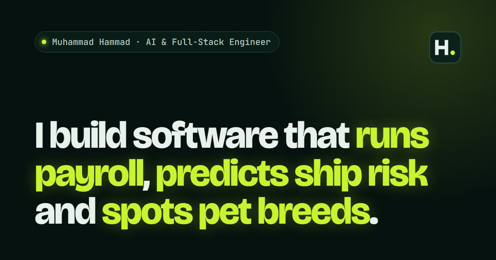

# Muhammad Hammad's Portfolio

> I build software that runs payroll, predicts ship risk and spots pet breeds.

Personal portfolio of **Muhammad Hammad**, an AI and full-stack engineer in Lahore working across React, Node.js, TypeScript, Python, LLM agents and computer vision.

**Live site: [nyroxtitan.github.io](https://nyroxtitan.github.io/)**

[](https://nyroxtitan.github.io/)

## What's inside

- **Case studies** for WeekViz, Vessel Inspection Intelligence, Petify and EME6, each with a screenshot or diagram, highlights and the part I owned
- **About** and **How I work**
- **Experience** and education
- **Contact** with a one-click "copy email" button
- Responsive down to small phones, keyboard friendly, and respects reduced-motion settings

Built with plain **HTML, CSS and JavaScript**: no framework, no build step, no dependencies.

## Project structure

```text
.
├── index.html     all page content: text, projects, links
├── style.css      styles; colours are the tokens at the top
├── script.js      mobile menu, scroll effects, screenshot viewer, copy email
├── Assets/        screenshots (.webp), favicon, link-preview image
└── .gitignore     files kept locally but not uploaded (CV source, original PNGs)
```

## Run it locally

Open `index.html` in a browser, or serve the folder:

```bash
python -m http.server 8000
# then open http://localhost:8000
```

## Publish with GitHub Pages

1. Push this repository to GitHub on the `main` branch.
2. Open **Settings → Pages**.
3. Under **Build and deployment**, set **Source** to *Deploy from a branch*, pick **main** and **/ (root)**, then click **Save**.
4. After a minute or two the site is live at <https://nyroxtitan.github.io/>.

Every push to `main` after that updates the live site automatically.

> [!NOTE]
> On a free GitHub plan the repository must be **public** for Pages to work. GitHub Pages is also case-sensitive, so keep paths exactly as written (`Assets/`, not `assets/`).

## Updating the site

| To change | Edit |
| --- | --- |
| Text, projects, links | `index.html` |
| Colours, fonts, spacing | the tokens at the top of `style.css` |
| A screenshot | add the image to `Assets/` (WebP keeps it small) and point the `` at it |

## Palette

| Role | Hex |
| --- | --- |
| Background | `#06120F` |
| Surfaces | `#0D211B` |
| Primary text | `#E8F1EC` |
| Muted text | `#7F9A8F` |
| Accent (glowing lime) | `#C6F432` |
